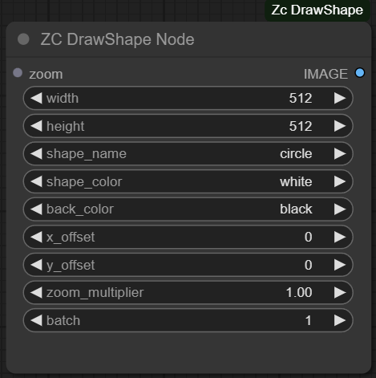

# 🐉 ZC Shape
 
Author : Zohac

Current version: 1.0

## Installation

1. Navigate to the `custom_nodes` directory:
    ```sh
    cd custom_nodes
    ```
2. Clone the repository:
    ```sh
    git clone https://github.com/zohac/comfyui-shape-drawer.git
    ```
3. Restart ComfyUI.

## List of Custom Nodes
  
### Nodes
* DrawShape

## Usage



The `zoom` input is an array of floats, which allows specifying different zoom levels for each image in the batch.

## Contributing
Contributions are welcome! Please submit a pull request or open an issue to discuss the changes you would like to make.

## License
This project is licensed under the MIT License. See the LICENSE file for details.
